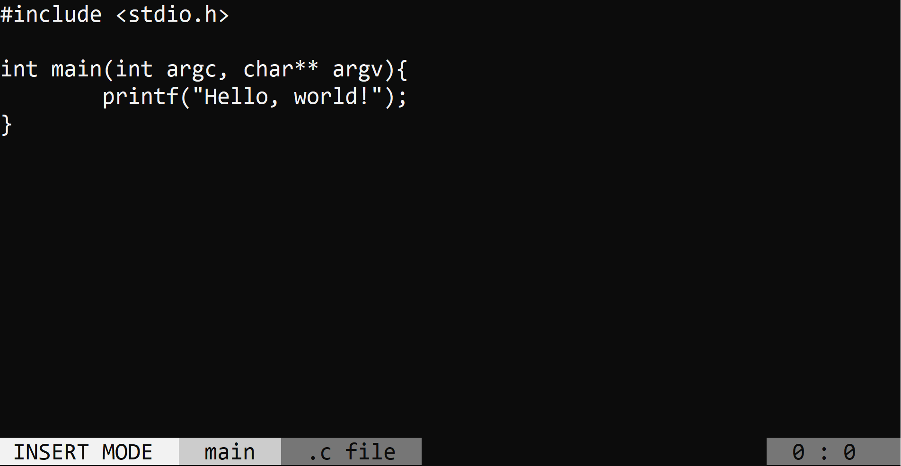

# micro editor
**A small and simple cmd text-editor.**
*Designed as a C# equivalent to vi on windows*

## Installation

OS X & Linux:
wip

Windows:
wip

## Usage example
wip

## Development setup
wip

## Release History

* 0.0.1
    * Work in progress

## Meta
wip

Distributed under the MIT license. See ``LICENSE`` for more information.

[https://github.com/Tristan-Brulotte/micro](https://github.com/Tristan-Brulotte/micro)
